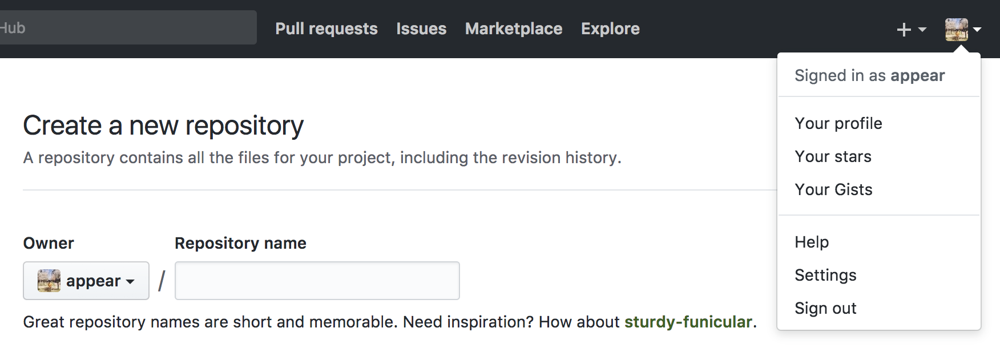
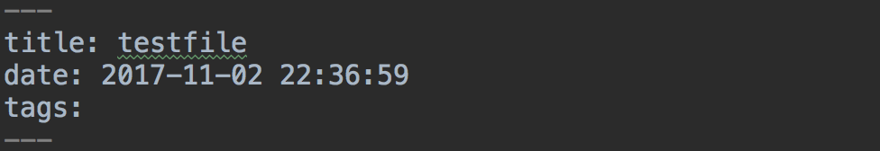
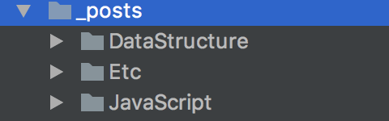
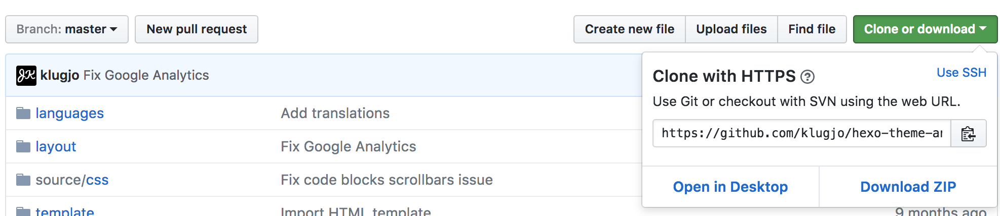
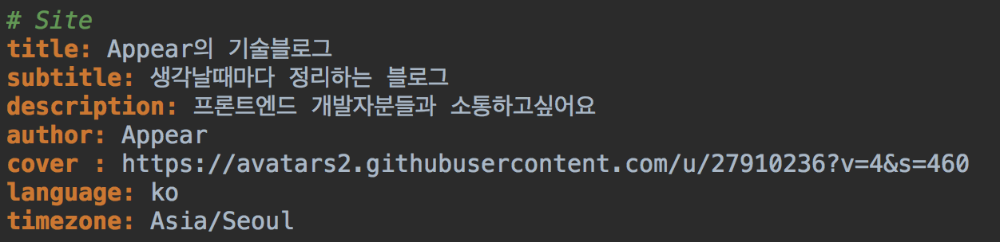
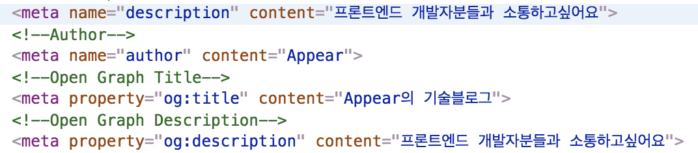
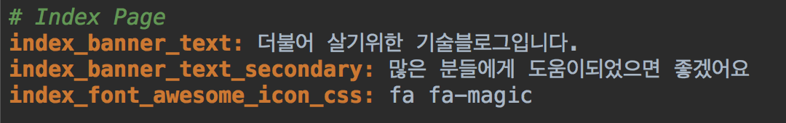
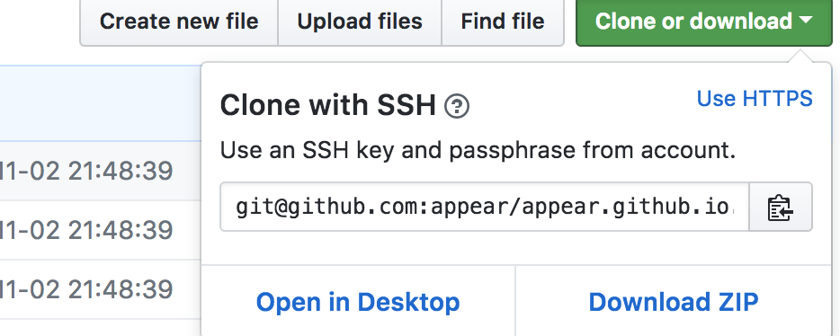

# Hexo 블로그 만들기
제가 처음 블로그를 시작하려고 여기저기를 찾아봤는데요. 
티스토리, 네이버블로그, 미디엄등 좋은 블로그는 많았지만 뭔가 제약사항이 많았고 [마크다운](https://ko.wikipedia.org/wiki/%EB%A7%88%ED%81%AC%EB%8B%A4%EC%9A%B4)을 지원하지않아 저는 Hexo를 선택했습니다.   

[Hexo](https://hexo.io/ko/index.html)는 [Github 페이지](https://pages.github.com/)를 이용한 정적 블로그 프레임워크입니다. Node 기반으로 이루어져있습니다.

간단하게 Hexo로 블로그를 만드는 방법에 대해서 알아보겠습니다.  

github.io로 끝나는 주소들의 블로그를 많이 보셨을텐데요. 저런 주소들이 바로 Github 페이지를 이용한 블로그입니다.   

## Github Repository 만들기 
새로운 Repository를 만들어주시고 Repository 이름은 꼭 username.github.io로 만들어주셔야합니다.

오른쪽위에 보시면 Signed in as username (저의 경우 appear)을 보실 수 있습니다.  
##### 저는 appear.github.io 라는 이름으로 Repository를 만들었습니다.

## Hexo 설치 
> npm install -g hexo-cli 로 설치해주세요

##### [Node](https://nodejs.org/ko/) 가 설치안된분들은 Node를 설치해주세요 (버젼은 상관없어요)

## Git Clone 받기
우리가 만든 Repository에 이제 Hexo를 받아야되요. 아무 IDE나 상관없습니다. Github에서 만들어진 Repository를 Clone 받아주세요.

## Hexo 시작하기
IDE에서 Git에서 Clone받은 프로젝트의 root에 있으셔야합니다. 

##### 폴더의 root에 위치하시고 터미널에 hexo init blog 라고 입력해주세요

그러면 blog라는 폴더가 생기셨을거에요 

##### cd blog 를 입력해서 blog 폴더로 들어가주세요 그리고 npm install 을 입력해주세요  

이런 폴더구조가 만들어졌다면 성공입니다!

##### hexo serve 를 입력해주세요 로컬에서 서버를 띄워서 테스트 해볼 수 있는 환경입니다. localhost:4000 로 접속해보세요 잘 나오시나요? 
 
 

기본테마입니다. 기본테마가 마음에 드시면 바로 사용하셔도 무방해요

## Hexo 글쓰기
##### blog 폴더안에서 hexo new post 만들파일이름 을 적어주시면 source/_posts 폴더안에 만든 파일이 생길거에요. 파일을 열어볼게요 (아직 테마 적용전이라 저랑 살짝 다를 수 있습니다.)

 
   
- tilte : 글의 제목이에요 
- date : 만든 날짜입니다. 날짜에따라서 글이 정렬됩니다.   
- tags, categories : Javascript / Node 등 여러가지로 포스트를 분류할 수 있습니다.

##### 지금 진행중인 포스트의 형식입니다.
> title: Hexo로 블로그 만들기
 date: 2017-11-02 21:49:22
 tags: ["ETC", "HEXO"]
 categories: ["ETC", "HEXO"]
 layout: default
 
마크다운 문법에 익숙치 않으신분들은 [여기](https://gist.github.com/ihoneymon/652be052a0727ad59601)를 참고해주세요 

간단하게 글하나 작성해보죠 !

메인에서 확인해보실 수 있어요 간단하죠! 저랑은 아마 살짝 다르실거에요 저는 테마를 적용해서 ... 

 
저는 아래사진처럼 탭별로 포스트들을 관리하고 있습니다 :) 탭에따라 포스팅 분류하는건 아래서 살펴볼게요! 
  

## Hexo Theme 적용하기 
[여기](https://hexo.io/themes/index.html)에 가시면 많은 테마들을 볼 수 있습니다. 마음에 드시는걸 찜해주세요 

저는 [Anodyne](http://www.codeblocq.com/assets/projects/hexo-theme-anodyne/)라는 테마를 사용하고 있습니다.  
제가 사용하고있는 테마를 기준으로 설명드리겠습니다.

[여기](https://github.com/klugjo/hexo-theme-anodyne)에서 받으실 수 있습니다.  

 

##### 1. 기존의 themes 라는 폴더를 삭제해주세요

 

##### 2. 그리고 git clone https://github.com/klugjo/hexo-theme-anodyne themes/anodyne 새로운 테마를 받아주세요 (이때 위치는 blog 폴더 안이어야합니다)

##### 3. 새로운 themes가 잘 받아졌는지 확인해주세요 이제 조금의 설정이 필요합니다. blog/_config.yml 파일을 열어주세요 

##### 4. theme 이름을 우리가 받은 테마의 이름 anodyne로 바꿔주세요 localhost:4000 으로 확인해주세요 테마가 잘 적용되었나요 ?

## Hexo 기본설정 
### Open Graph
##### blog / _config.yml에 이부분을 수정해주면 

##### Open Graph 를 설정해 줄 수 있습니다.

### 대문글 설정
##### themes/anodyne 안에도 _config.yml이 있습니다. 이것은 테마에 대한 설정인데요 대문글을 바꿔보겠습니다.

### 메뉴설정
##### Hexo에서 / 경로는 blog/source 폴더를 의미합니다. 
글쓸때 tags 보셨죠. 이때 tags:['Javascript'] 로 설정해주시면 탭 만들때 자바스크립트 : tags/Javascript 로 해주시면 탭을 눌렀을때 Javascript tags의 포스트들만 볼 수 있어요   

를 들면 제 블로그 Javascript 태그 [이렇게](https://appear.github.io/tags/Javascript/)말이죠

### About 만들어보기 
기본적으로 About를 눌러보기면 404가 떨어질거에요. 아직 About 페이지가 없어서그래요 만들어보겠습니다.

##### hexo new post about 로 포스트를 하나 만들어주세요   

이제 About 탭을 눌르시면 About 페이지가 보이실거에요. 만약 안보이신다면 파일 경로, 탭의 경로 잘 확인해주세요 

## 배포해보기
이제 로컬을 벗어나서 직접 배포해보겠습니다.   

우리가 만든 github Repository의 주소를 blog/_config.yml 에 입력해주세요

> npm install hexo-deployer-git --save 배포전에 설치가 필요합니다.

##### 이제 배포만 남았습니다!

> hexo clean && hexo generate && hexo deploy 입력해주세요

##### https://username.github.io/ 로 들어가서 확인해보세요! 배포후 노출까지 조금 시간이 걸리 수 있어요 

