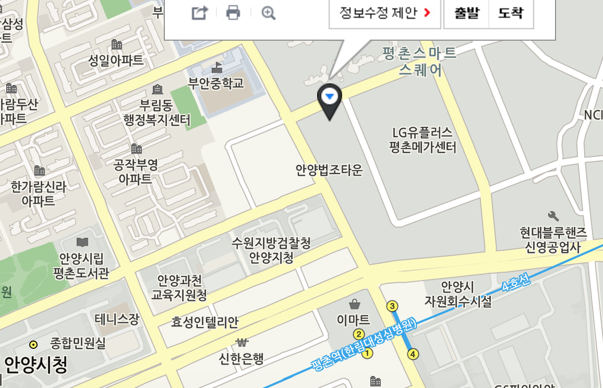
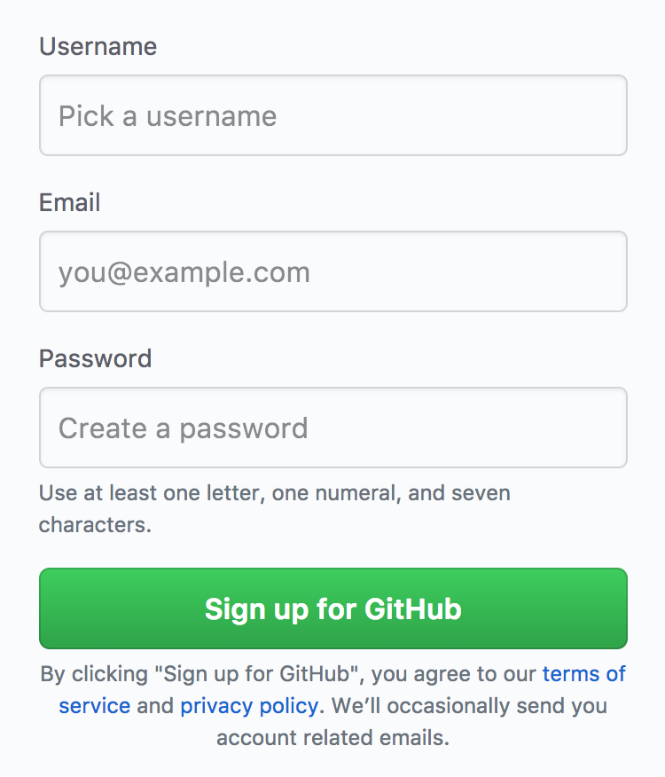

## 장소 
평촌 에이큐브

## 준비사항

### 1. WebStorm 설치
webstorm IDE : https://www.jetbrains.com/webstorm/ 

사진에 보이시는것처럼 라이센스서버 탭 클릭하시고 아래 라이센스 서버를 넣어주시면됩니다.
라이센스 서버 : (http://idea.iteblog.com/key.php)         

### 2. Git 설치
참고해주세요
https://git-scm.com/book/ko/v2/%EC%8B%9C%EC%9E%91%ED%95%98%EA%B8%B0-Git-%EC%84%A4%EC%B9%98

### 3. Github 아이디만들기
https://github.com/ 에 들어가셔서 

username은 이쁘게 만들어주세요 - 는 금지입니다! (ex.hello-git)    
이쁘게 만들어주셔야 블로그만들때 좋습니다 :) 도메인이 될거라서요 

### 4. Node 설치 
Mac 쓰시는분들은 brew로 설치해주시면됩니다.

- Home-brew 설치 : /usr/bin/ruby -e "$(curl -fsSL https://raw.githubusercontent.com/Homebrew/install/master/install)" -> brew update        
- Node.js & npm 설치 : brew install node
       
윈도우 쓰시는분들은 https://nodejs.org/ko/ 설치해주세요 버젼은 상관없습니다 :) 
       
### 유용한 플러그인
git Tree : https://chrome.google.com/webstore/detail/octotree/bkhaagjahfmjljalopjnoealnfndnagc?hl=ko      
postman : https://chrome.google.com/webstore/detail/postman/fhbjgbiflinjbdggehcddcbncdddomop      
Allow-Control-Allow-Origin : https://chrome.google.com/webstore/detail/allow-control-allow- origi/nlfbmbojpeacfghkpbjhddihlkkiljbi?hl=ko        
library-detector : https://chrome.google.com/webstore/detail/library-detector/cgaocdmhkmfnkdkbnckgmpopcbpaaejo       
JsonParser : https://chrome.google.com/webstore/detail/jsonview/chklaanhfefbnpoihckbnefhakgolnmc?hl=ko
           
### 나중에 쓸거 
Json-server : npm i -g json-server      
Browser-sync : npm install -g browser-sync       
esLint : npm install -g eslint eslint-config-airbnb-base eslint-plugin-import / 실행법 : eslint 파일명      
Intellij Live Template : https://uncle-bae.blogspot.kr/2015/09/intellij-live-template.html      
SSH Key 등록 : https://xho95.github.io/macos/security/openssh/ssh/gitlab/2017/02/21/Using-SSH-on-Mac.html    

## 목차
- 1주차 : 자바스크립트의역사 / 브라우저 동작원리 / 자료형과 변수 / 연산자 / Github으로 저장소관리하기   
- 2주차 : 조건문 / 반복문 / 객체 / Window / BOM    
- 3주차 : 함수 / 프로토타입 / 배열      
- 4주차 : 스코프 / 실행컨텍스트 / 클로저 / 즉시실행 / 네임스페이스를 통한 모듈화    
- 5주차 : DOM 선택, 탐색, 조작, 이벤트    
- 6주차 : JQuery / Ajax    
- 7주차 : 모던 스크립트 Babel / ES6 알아보기 
- 8주차 : Node / package /  MongoDB /  Restful api / Passport 회원가입 로그인 해보기
- 9주차 : React / Webpack / TodoApp 만들어보기
